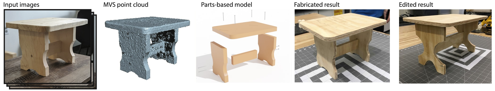

# Carpentry Shape Detection
## Overview

This is the code for the paper "[Fabrication-Aware Reverse Engineering for Carpentry](https://arxiv.org/abs/2107.09965)" by James Noeckel, Haisen Zhao, Brian Curless, and Adriana Schulz. The system reverse engineers carpentered objects from multi-view imagery, along with a point cloud created from these images using appropriate software for reconstruction.

**Citation**

If you use this code for your research, please consider citing:
```
@article{article,
author = {Noeckel, James and Zhao, Haisen and Curless, Brian and Schulz, Adriana},
year = {2021},
month = {08},
pages = {301-314},
title = {Fabrication‐Aware Reverse Engineering for Carpentry},
volume = {40},
journal = {Computer Graphics Forum},
doi = {10.1111/cgf.14375}
}
```

## Building and installation instructions
This project depends on OpenCV, LibIGL, CGAL, Pagmo, libIGL, and [MAXFLOW](http://pub.ist.ac.at/~vnk/software.html). OpenMP is also preferred.
For MAXFLOW, place the "maxflow" folder into the project root directory.
To build, run
```sh
mkdir build
cd build
cmake .. -DLIBIGL_INCLUDE_DIR=<path to /libigl/include> -DCMAKE_BUILD_TYPE=Release
make CarpentryOptimization
```

## Running
Run the `CarpentryOptimization` executable with a path to a configuration file as an argumment (see `examples/customstool.txt` as an example). The example data currently needs to be downloaded separately: [get it here](https://drive.google.com/file/d/16VQeez8vya6cB7WhLDWmjhHzla2AK-3u/view?usp=sharing), and place the folder within a folder named `data/`.
The configuration file contains many parameters that affect the algorithm. Additionally, you may choose whether to obtain interactive 3D visualization of results at various stages of the pipeline by setting `visualization=1`.

The important settings for running with your own data are:
- points_filename: path to the point cloud data
- reconstruction_path: path to the associated reconstruction data containing the camera pose information for each view (this is assumed to be in the [bundler](https://www.cs.cornell.edu/~snavely/bundler/bundler-v0.4-manual.html) format)
- result_path: where to save results
